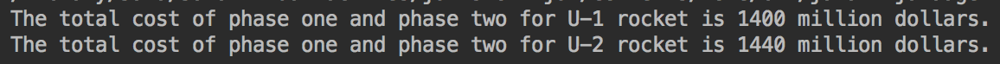

## Space Challenge

A mission simulation of two rockets.

This is a trainning project of Udacity's Java Basics Nano-degree. The purpose of the project is to pratice the basic concepts and skills of Java, like Java inhertance & polymorphism, Java interface & class, Java collection like ArrayList, etc.